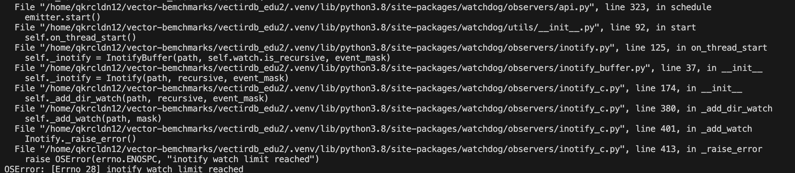
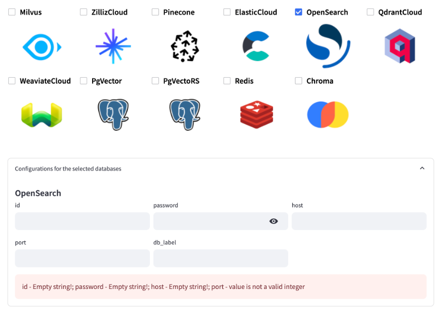

# NCP 파트너 세미나 - VectorDB
NCP 파트너 세미나 Vector DB의 HoL 자료 입니다.  
지속적으로 관심을 가지고 업데이트 예정 입니다.
- 업데이트 예정 기능및 현재 기능상 이슈는, Issues를 참고해주세요

<br>

## 공통
### 테스트 완료된 환경
- 운영체제 : 리눅스
- 파이썬 버전 : python3.8 이상

<br>

### 제공되는 기능
1. [OpenSearch 실습](#OpenSearch-실습)
1. [OVectorDB Benchmark](#VectorDB-Benchmark)

<br>

# OpenSearch 실습

### 사용 가능 임베딩 모델
| 환경           | 모델명             | 차원   | 유사도 측정 방식 |
| :------------ | :--------------- | :---- | :----------- |
| HCX           | clir_sts_dolphin | 1024  | cosine       |
| HCX           | clir_emb_dolphin | 1024  | L2           |
| 커스텀(허깅페이스) | bge-m3           | 1024  | cosine       |

## 설치 방법

### 코드 설치

```bash
## 다운로드
git clone https://github.com/chupark/partner-vectordb.git

## 가상환경 세팅 (선택)
python3 -m venv .venv

## 가상환경 세팅 (선택)
. .venv/bin/activate

## 패키지 설치
pip install -r requirements.txt
```

<br>

### 환경변수 설명
```bash
## CLOVA_X Embedding
# HyperClovaX의 임베딩 API를 사용하기 위한 환경변수 입니다.
export X_NCP_CLOVASTUDIO_API_KEY=""
export X_NCP_APIGW_API_KEY=""
export EMB_APP_ID=""

## OpenSearch
# OpenSearch 작업을 수행하기 위한 환경변수 입니다.
export OSH_HOST=""
export OSH_ID=""
export OSH_PW=""
```

<br>

### Streamlit 실행
```bash
## 아래 명령어들을 입력하여 환경변수를 설정합니다.

## HyperClova X
export X_NCP_CLOVASTUDIO_API_KEY=""
export X_NCP_APIGW_API_KEY=""
export EMB_APP_ID=""

## OpenSearch
export OSH_HOST=""
export OSH_ID=""
export OSH_PW=""

## streamlit_chat 폴더로 이동하여 아래 명령을 수행합니다.
streamlit run main.py
```

### Streamlit 실행시 에러가 발생할 경우

#### 옵션 1
아래 코드를 bash쉘에서 실행
```bash
### Debian 계열 리눅스일 경우
sudo apt-get install gvfs libglib2.0-bin

### cat /proc/sys/fs/inotify/max_user_watches 파라미터 확인

sudo vi /etc/sysctl.conf

### 아래 내용을 맨 아래 줄에 추가
fs.inotify.max_user_watches=524288

### 아래 명령어 실행
sudo sysctl -p
```

#### 옵션 2

아래 코드로 실행
```bash
streamlit run main.py --server.fileWatcherType none
```

#### 옵션 3
아래 링크에서 조치사항 적용
- https://code.visualstudio.com/docs/setup/linux#_conflicts-with-vs-code-packages-from-other-repositories

<br>

### 주피터 노트북 실행
venv환경에서 주피터 노트북 파일 opensearch.ipynb를 실행하려면 `.venv/bin/activate` 파일 마지막에 아래와 같이 환경변수 추가 명령을 입력합니다.
  

위의 설정을 추가 완료한 후 `opensearch.ipynb`파일을 사용할 수 있습니다.

<br>

## Streamlit 사용 방법

create index 메뉴에서 아래 기능을 수행할 수 있습니다.
- 인덱스 생성
- 인덱스 삭제
- 인덱스에 데이터 추가

인덱스 생성기는 nmslib의 HNSW알고리즘만 사용하게 만들어졌습니다.

### 인덱스 생성기

- dimension : 벡터 차원 설정
- space_type : 유사도 계산법
- index_name : 인덱스 이름
- embedding_model_name : 임베딩 모델 이름
  - 기본적으로 HyperClova X의 임베딩 모델을 사용합니다.
  - `streamlit_chat/modules/OpenSearch.py` 파일의 `text_to_vector method`s를 수정하여 커스텀 임베딩 모델을 사용할 수 있습니다.

#### 인덱스 생성
붉은색 `Index 생성하기` 버튼을 클릭하면 인덱스를 생성합니다.

#### 인덱스 삭제
붉은색 `Delete` 버튼을 클릭하면 해당 인덱스를 삭제합니다.

#### 인덱스에 데이터 추가
하얀색 `Insert` 버튼을 클릭하면 해당 인덱스에 데이터를 삽입합니다. 사용되는 데이터는 `streamlit_chat/data/starcraft2.csv` 파일입니다.
> 데이터 추가 후 중앙의 인덱스 화면에 Total Docs가 0이라면 붉은색 `새로고침` 버튼을 클릭합니다.

<br>

### 검색

- 데이터를 검색합니다. 최대 검색 수는 15개 입니다.
- index를 선택하고 해당 인덱스의 데이터를 쿼리합니다.

#### Normal_Vector_Search
- 일반적인 벡터 검색을 수행합니다.
- 벡터화된 Column은 `starcraft2.csv`파일의 `Completion` Column입니다.

#### Hybrid_Search
- OpenSearch 내부의 SearchPipeline을 사용하여 하이브리드 검색을 수행합니다.
- `starcraft2.csv` 파일의 `Text` Column을 `Completion` Column, 벡터화된 `Completion` Column을 사용한 하이브리드 검색 입니다.

#### Question_Hybrid_Search
- `starcraft2.csv` 파일의 `Text` Column을 벡터화된 `Completion` Column을 사용한 하이브리드 검색 입니다.

#### Completion_Hybrid_Search
- `starcraft2.csv` 파일의 `Completion` Column을 벡터화된 `Completion` Column을 사용한 하이브리드 검색 입니다.

#### Question_Text_Search
- 텍스트 검색을 수행합니다. `starcraft2.csv` 파일의 `Text` Column을 사용합니다.

#### Completion_Text_Search
- 텍스트 검색을 수행합니다. `starcraft2.csv` 파일의 `Completion` Column을 사용합니다.

### 검색 결과


<br>

# VectorDB Benchmark


## 설치 방법
소스코드 다운 : https://github.com/chupark/vector-db-bench  
설치법링크 참조 : https://github.com/zilliztech/VectorDBBench

## 사용 방법
사용법 링크 참조 https://github.com/zilliztech/VectorDBBench

<br>

### 인덱스 및 컬렉션 영구 저장시
인덱스 및 컬렉션 등 벡터 데이터 저장소를 영구저장하면 오래 걸리는 데이터 적재 작업을 생략할 수 있습니다.
`vectordb_bench/backend/clients/\<Your-DB>/\<Your-DB>.py`파일의 내용을 직접 수정해야합니다.

<br>

#### Milvus 예시


<br>

#### OpenSearch 예시
